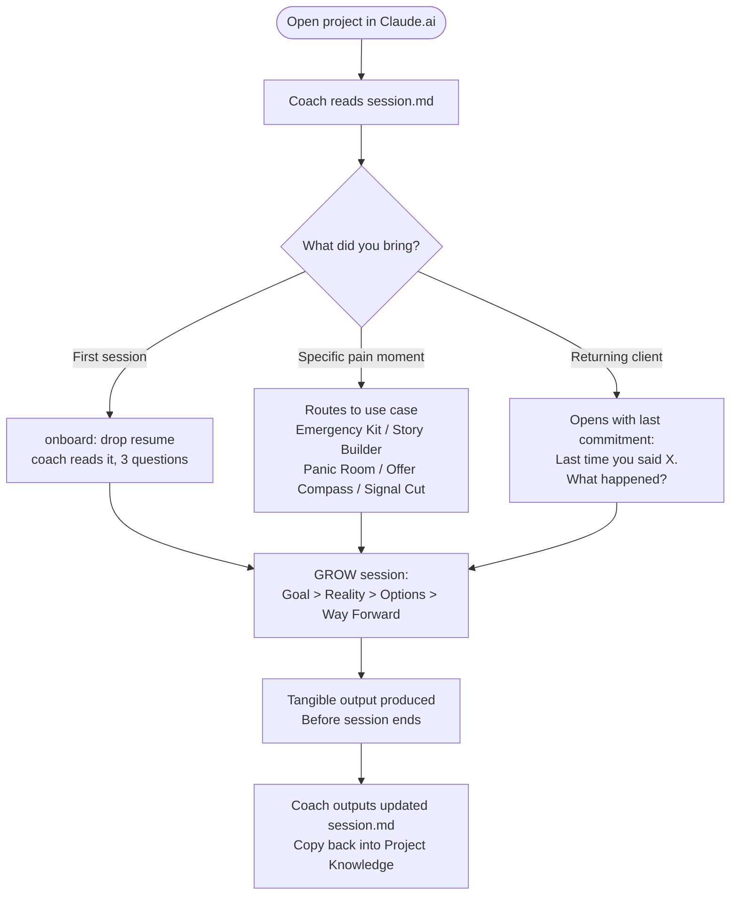

# Relaunch PM Coach

**Your access just got cut. Your interview is in 48 hours. You have two offers and you're deciding from fear.**

This coach meets you at the specific painful moment. Asks questions. Pushes back. Holds you accountable. Produces something tangible before the session ends.

Not a knowledge base. Not a chatbot. A coach.

---

## Quick Start - 3 Steps

**1. Create a Claude.ai Project**
Go to [claude.ai](https://claude.ai) and create a new Project.

**2. Upload all 22 files**
```
CLAUDE.md              identity.md            session.md
LEARNINGS.md           onboard-context.md     interview-context.md
skill-context.md       direction-context.md   ai-ecosystem.md
coaching-moves.md      study-mate.md          signal-vs-noise.md
icf-ethics.md          pm-skills-context.md   evals.md
eval-checklist.md      emergency-kit.md       ai-story-builder.md
interview-panic-room.md offer-compass.md      signal-cut.md
AI_Ecosystem_Strategy_Course.txt
```
All flat files. Select all, drag-drop into Project Knowledge.

**3. Start**
Type `onboard` for your first session. Or just describe what's happening right now - the coach will route to the right mode automatically.

No installs. No config. No CLI.

---

## What This Coach Does

Five focused use cases, each at a specific painful moment, each producing something tangible.

### 1. Layoff Day Emergency Kit
Your access just got cut. You're in shock. Coach walks you through the next 72 hours without making a fear-driven decision.

**Output: a written Week 1 plan before the session ends.**

Say: *"I just got laid off"* or *"my access just got cut"*

---

### 2. AI Story Builder
10 years of experience. Zero AI on the resume. Coach finds the AI lens in your existing work and builds 3 interview-ready stories.

**Output: 3 STAR stories with AI vocabulary you can tell Monday.**

Say: *"I have no AI experience on my resume"* or *"I don't know how to talk about AI"*

---

### 3. Interview Panic Room
Interview in 48 hours. No prep done. Coach runs story, STAR, mock, and debrief in one session. One thing to fix. Conviction to walk in.

**Output: a one-page brief - story, one fix, what you're walking in to show.**

Say: *"Interview tomorrow"* or *"interview in 48 hours"*

---

### 4. Offer Compass
Two offers. Deciding from fear. Coach runs IFS parts work and ACT values. Finds out which internal part is deciding - Scared or Self.

**Output: a written decision made from values, not anxiety. A bad offer decision costs 18 months.**

Say: *"I have two offers"* or *"should I take this offer"*

---

### 5. Signal Cut
Overwhelmed by AI courses and content. Coach takes the "I need to learn X" list and runs it through signal vs. noise. Everything that doesn't affect the next interview or first 90 days gets dropped.

**Output: 2-3 things that actually matter, written list, everything else explicitly dropped.**

Say: *"I don't know what to learn"* or read your list out loud

---

## Deeper Coaching Modes

For longer engagements beyond the 5 use cases:

| Mode | What it covers |
|---|---|
| `start interview` | Full narrative arc, STAR library, AI lens, mock with debrief |
| `start skill` | Real gap vs. imagined gap, evals thinking, ZPD learning path |
| `start direction` | Big Tech vs. startup vs. build - IFS, ACT values, Bezos regret test |

---

## How Sessions Work



**After every session:** Copy the updated `session.md` the coach outputs back into Project Knowledge. This is the only manual step - without it, the next session starts blank.

---

## Session Memory

`session.md` is the single source of truth. It tracks:
- Your background, layoff context, runway, fears in your own words
- Active mode and session count
- Every commitment - never auto-closed, always checked at next session open
- Patterns observed across sessions

You never repeat yourself. The coach remembers.

---

## What This Coach Does Differently

| What you won't get | What you will get |
|---|---|
| Generic advice for "post-layoff PMs" | A coach at YOUR specific moment |
| "Here are 5 strategies to bounce back" | "Tell me what happened. What are you leaving out?" |
| "You've got this!" | "That sounds like fear talking. What do you actually want?" |
| A reading list | A tangible output before the session ends |
| Starting from scratch every session | A coach who remembers everything and holds you accountable |

---

## FAQ

**Do I need to type a command to start?**
No. Describe what's happening - *"my access just got cut"*, *"interview tomorrow"*, *"two offers and I'm panicking"* - and the coach routes to the right mode automatically. Only the first session needs `onboard`.

**What should I bring to the first session?**
Your resume or LinkedIn URL. The coach reads it, makes one real observation, then asks only what a document can't tell: runway, what you're scared of, what's most urgent.

**What about subsequent sessions?**
Nothing. Open the project and start talking. The coach reads session.md and opens with your last commitment.

**What if I forget to update session.md?**
The next session starts without memory. Always copy the updated session.md the coach outputs before closing.

**Will this coach tell me what job to take?**
No. It will help you think clearly enough to decide yourself.

**How long until results?**
Session 1: you leave with something tangible and feel understood, not interrogated.
Sessions 1-3: the real picture comes into focus.
Sessions 4-8: patterns get named, accountability compounds, progress becomes visible.
Sessions 9+: you start coaching yourself. That is the goal.

---

Built for post-layoff PMs ready to come back. Not a shortcut. Just clarity.

---
---

## For Maintainers

Everything below is for maintaining and improving the coach. End users don't need any of this.

### Local Dev Setup (Claude Code)

```bash
git clone https://github.com/qwikchoice/RelaunchPM.git
cd RelaunchPM
bash setup.sh
```

`setup.sh` checks deps, installs claude-eval, installs pre-commit hook.

**Dependencies:**

| Tool | Version | Purpose |
|---|---|---|
| Claude Code CLI | 2.1.x+ | Session file writes to disk automatically |
| Node.js | v18+ | claude-eval runner |
| npm | any | install claude-eval |
| ANTHROPIC_API_KEY | - | eval-runner.sh + CI |

In Claude Code, `session.md` is written to disk automatically - no manual copy needed.

### Running Evals

```bash
./eval-runner.sh --quick     # 3-prompt smoke test (~30 sec)
./eval-runner.sh             # full 10-prompt run
./eval-runner.sh --prompt 3  # single prompt
```

Current score: 8/10. Passing threshold: avg 4.0/5, no criterion below 3, zero em-dashes.
eval-runner.sh mocks session state before running so prompts don't trigger onboard intake.

### CI

Every push to master triggers: em-dash gate then 10 YAML evals via `claude-eval`.
Requires `ANTHROPIC_API_KEY` secret set on the GitHub repo.

```bash
gh secret set ANTHROPIC_API_KEY --repo qwikchoice/RelaunchPM
```

### Human Scoring

Fill `eval-checklist.md` after each live session. Append row to eval log in `evals.md`.

### Drift Signals to Watch

- Bullet list appearing in opening response
- Em-dash in any response
- Aviation analogy missing on startup-idea triggers
- Tangible output skipped at session close

Full rubric in `evals.md`.

### Folder Structure

```
Relaunch_PM/
├── CLAUDE.md                    <- routing, global rules, first-session detection
├── identity.md                  <- coach backstory and beliefs (Alex)
├── session.md                   <- persistent client state
├── LEARNINGS.md                 <- session log; run distill to surface patterns
│
├── emergency-kit.md             <- Layoff Day: 72-hour plan
├── ai-story-builder.md          <- AI Story Builder: 3 STAR stories
├── interview-panic-room.md      <- Interview Panic Room: 48h, one fix, conviction
├── offer-compass.md             <- Offer Compass: IFS + ACT values decision
├── signal-cut.md                <- Signal Cut: 2-3 things, rest dropped
│
├── onboard-context.md           <- session 0 intake
├── interview-context.md         <- full interview prep mode
├── skill-context.md             <- skill pivot mode
├── direction-context.md         <- career direction mode
├── ai-ecosystem.md              <- aviation analogy, AI career layers
├── coaching-moves.md            <- empathy, reframes, stories, quotes
├── study-mate.md                <- memory + diagnosis + adaptation model
├── signal-vs-noise.md           <- what to learn vs ignore
├── icf-ethics.md                <- ICF ethics in practice
├── pm-skills-context.md         <- PM craft mentorship: 8 skill areas
│
├── setup.sh                     <- maintainer: one-time local dev setup
├── eval-runner.sh               <- maintainer: 10-prompt binary compliance check
├── eval-checklist.md            <- maintainer: human scoring form
├── evals.md                     <- maintainer: rubric, drift thresholds, eval log
├── evals/                       <- maintainer: 10 YAML evals for CI
└── .github/workflows/evals.yml  <- maintainer: CI pipeline
```
