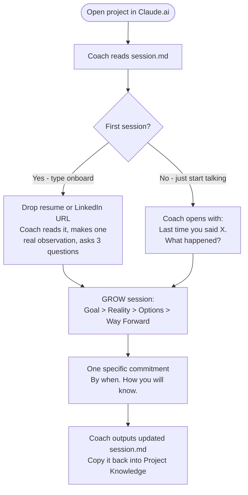
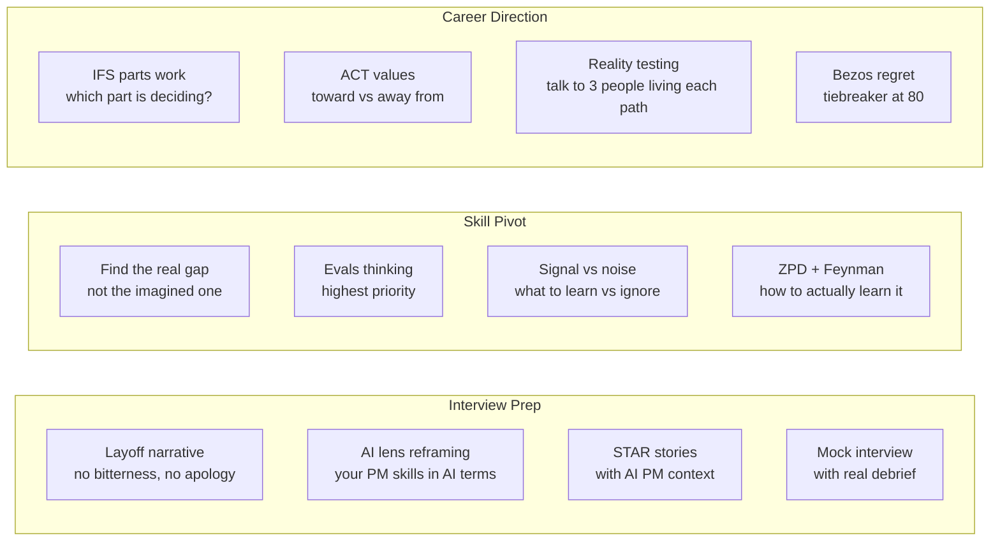

# Relaunch PM Coach

A personal AI coaching system for post-layoff PMs navigating the AI PM transition in 2026.

It's a coach, not a knowledge base. It asks questions. It pushes back. It tells you hard truths. It holds you accountable.

---

## Quick Start - 3 Steps

**1. Create a Claude.ai Project**
Go to [claude.ai](https://claude.ai) and create a new Project.

**2. Upload these 22 files**
```
CLAUDE.md              identity.md            session.md
LEARNINGS.md           onboard-context.md     interview-context.md
skill-context.md       direction-context.md   ai-ecosystem.md
coaching-moves.md      study-mate.md          signal-vs-noise.md
icf-ethics.md          pm-skills-context.md   evals.md
eval-checklist.md      emergency-kit.md       ai-story-builder.md
interview-panic-room.md offer-compass.md      signal-cut.md
AI_Ecosystem_Strategy_Course.txt
```
All files are flat - select all, drag-drop into Project Knowledge.

**3. Start**
Type `onboard` in your first session. Drop your resume or LinkedIn URL when asked. Coaching starts immediately after.

That's it. No installs. No config. No CLI.

---

## How Sessions Work



**After every session:** The coach outputs an updated `session.md` in the chat. Copy it and replace the file in Project Knowledge. This is the only manual step - without it, the next session starts blank.

---

## Session Memory

`session.md` is the single source of truth. It tracks:
- Your background, layoff context, runway, fears in your own words
- Active mode and session count
- Every commitment you've made - never auto-closed, always checked at next open
- Patterns observed across sessions

You never repeat yourself. The coach remembers.

---

## Commands

| Command / What you say | What happens |
|---|---|
| `onboard` | First-time intake - drop your resume, coach reads it, 3 questions |
| "I just got laid off" / "access just cut" | Layoff Day Emergency Kit - 72-hour plan, no fear decisions |
| "I have no AI on my resume" | AI Story Builder - finds AI lens in existing work, 3 interview-ready stories |
| "Interview tomorrow" / "48 hours" | Interview Panic Room - story, mock, debrief, one fix, conviction |
| "Two offers" / "should I take it" | Offer Compass - IFS parts work, ACT values, decision from Self not Fear |
| "Too much to learn" / reads a list | Signal Cut - 2-3 things that matter, everything else dropped in writing |
| `start interview` | Full interview prep: narrative, STAR stories, AI lens, mock |
| `start skill` | Skill pivot: find the real gap, close it with focused work |
| `start direction` | Career direction: values, IFS, Bezos, reality testing |
| `signal check` | Run current concern through signal vs noise framework |
| `mock interview` | Simulated AI PM interview with full debrief |
| `check commitments` | Review open commitments from last session |
| `distill` | Surface patterns from LEARNINGS.md, promote to coaching files |

---

## Three Modes



---

## PM Craft Mentorship

When you name a specific PM skill gap, the coach:
1. Runs a diagnostic to find the precise gap, not the stated gap
2. Deploys a Show Me exercise in session (doing surfaces gaps faster than asking)
3. Assigns a specific pm-skills exercise as homework
4. Reviews your output next session and holds you accountable

Draws on Torres OST, Cagan strategy, Olsen Opportunity Score, Wodtke OKRs, JTBD, Ellis NSM, and 65 PM skills across 8 domains.

---

## What This Coach Does Differently

| What you won't get | What you will get |
|---|---|
| "Here are 5 strategies to bounce back" | "Tell me what happened. What are you leaving out?" |
| "You've got this!" | "That sounds like fear talking. What do you actually want?" |
| Reading lists | Exercises that surface your real gap |
| Career advice | Questions that make you think clearly enough to decide yourself |
| Starting from scratch every session | A coach who remembers everything and holds you accountable |

---

## FAQ

**What should I bring to the first session?**
Your resume or LinkedIn URL. The coach reads it, makes one real observation, then asks only what a document can't tell: runway, what you're scared of, what's most urgent.

**What should I bring to subsequent sessions?**
Nothing. Open the project and start talking. The coach reads session.md and opens with your last commitment.

**What if I forget to update session.md after a session?**
The next session starts without memory of the last one. Always copy the updated session.md the coach outputs back into Project Knowledge before closing.

**Will this coach tell me what job to take?**
No. It will help you think clearly enough to decide yourself.

**How long until results?**
Session 1: feel understood, not interrogated.
Sessions 1-3: the real picture comes into focus - what is actually holding you back.
Sessions 4-8: patterns get named, commitments get harder, progress becomes visible.
Sessions 9+: you start coaching yourself. That is the goal.

---

Built for post-layoff PMs ready to come back. Not a shortcut. Just clarity.

---
---

## For Maintainers

Everything below is for maintaining and improving the coach. End users don't need any of this.

### Local Dev Setup (Claude Code)

```bash
git clone https://github.com/qwikchoice/RelaunchPM.git
cd RelaunchPM
bash setup.sh
```

`setup.sh` checks deps, installs claude-eval, installs pre-commit hook.

**Dependencies:**

| Tool | Version | Purpose |
|---|---|---|
| Claude Code CLI | 2.1.x+ | Session file writes to disk |
| Node.js | v18+ | claude-eval runner |
| npm | any | install claude-eval |
| ANTHROPIC_API_KEY | - | eval-runner.sh + CI |

In Claude Code, `session.md` is written to disk automatically - no manual copy needed.

### Running Evals

```bash
./eval-runner.sh --quick     # 3-prompt smoke test
./eval-runner.sh             # full 10-prompt run
./eval-runner.sh --prompt 3  # single prompt
```

Passing threshold: avg 4.0/5, no criterion below 3, zero em-dashes.

### CI

Every push to master triggers: em-dash gate then 10 YAML evals via `claude-eval`.
Requires `ANTHROPIC_API_KEY` secret set on the GitHub repo.

```bash
gh secret set ANTHROPIC_API_KEY --repo qwikchoice/RelaunchPM
```

### Human Scoring

Fill `eval-checklist.md` after each live session. Append row to eval log in `evals.md`.

### Drift Signals to Watch

- Aviation analogy missing on startup-idea triggers
- Empathy skipped in lower-stakes sessions
- Em-dash creep in responses

Full details in `evals.md`.

### Folder Structure (full)

```
Relaunch_PM/
├── [17 coaching files - see Quick Start above]
├── setup.sh                    <- maintainer: one-time local dev setup
├── eval-runner.sh              <- maintainer: automated 10-prompt compliance check
├── eval-checklist.md           <- maintainer: human scoring form per session
├── evals.md                    <- maintainer: rubric, drift thresholds, eval log
├── evals/                      <- maintainer: 10 YAML evals for CI
└── .github/workflows/evals.yml <- maintainer: CI pipeline
```
