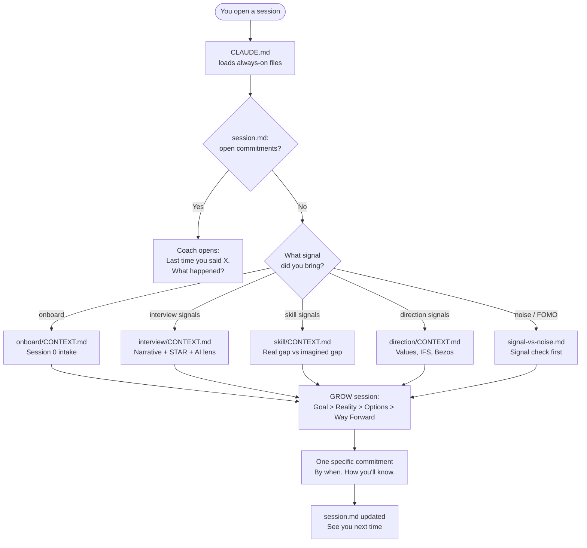
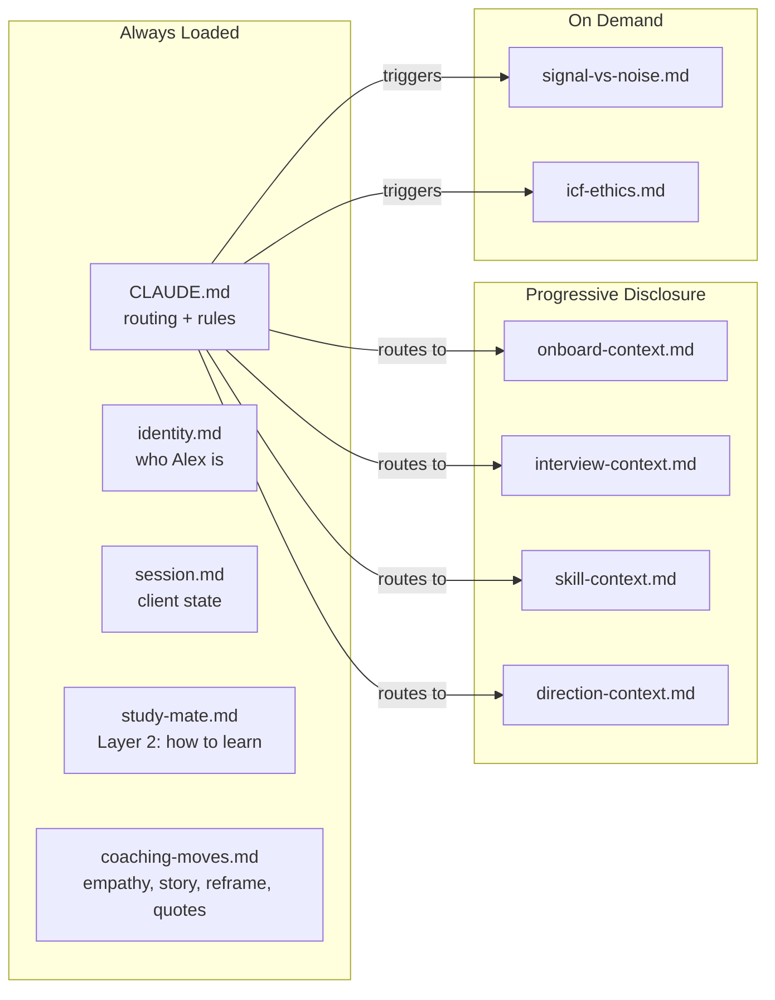
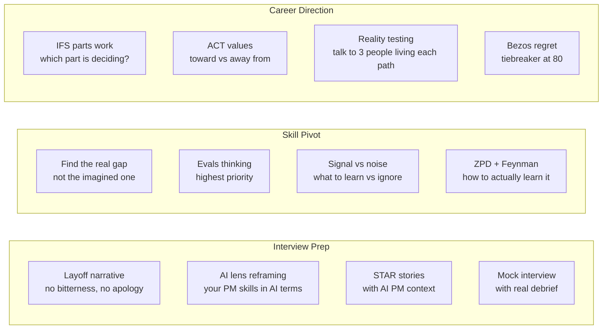
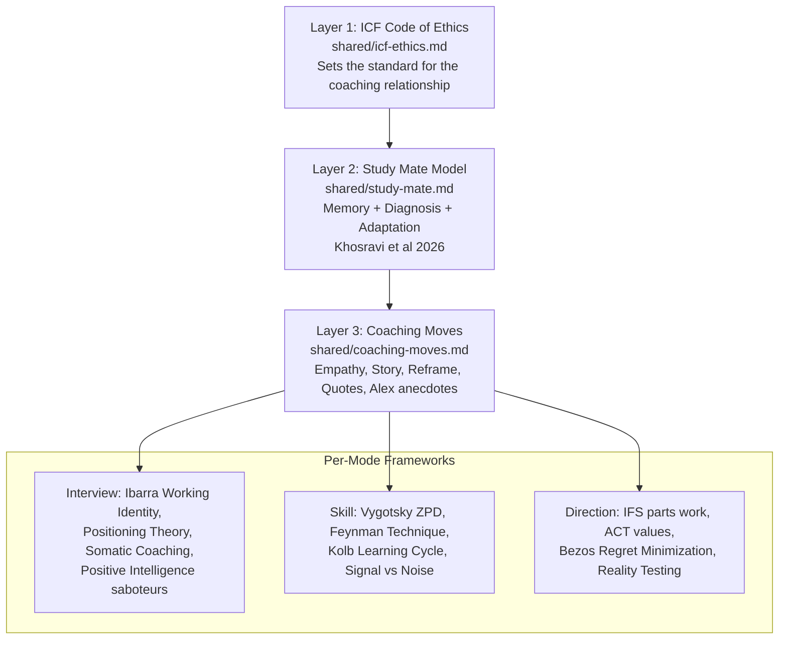
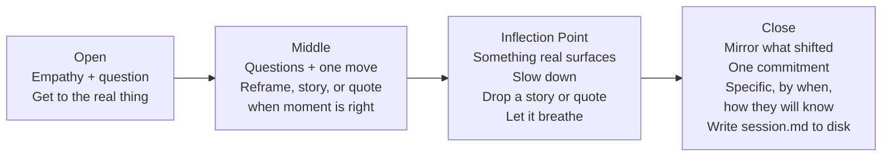
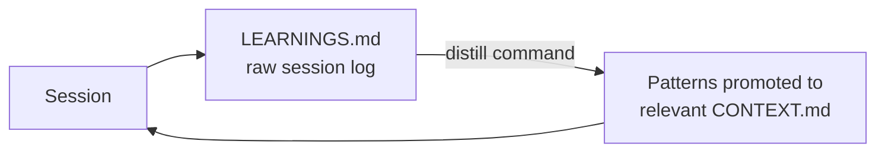

# Relaunch PM Coach

A personal AI coaching system for post-layoff PMs navigating the AI PM transition in 2026.

It's a coach, not a knowledge base. It asks questions. It pushes back. It tells you hard truths. It holds you accountable.

---

## How It Works



---

## Architecture



CLAUDE.md is routing only. Coaching craft lives in shared/. Mode-specific frameworks live in CONTEXT.md files. Nothing loads until needed.

---

## The Three Modes



---

## Coaching Framework (3 Layers)



---

## Session Shape



---

## Session Memory and Auto-Learning

### How Memory Works
Every session ends with the coach writing `session.md` to disk. This file tracks:
- Client profile (background, layoff context, runway, fears in their own words)
- Active mode and session count
- Every commitment made — never auto-closed, always checked at next session open
- Patterns observed across sessions (saboteurs, thinking traps, what creates momentum)
- Progress markers toward coaching goals

On the next session open, the coach reads `session.md` first. You never repeat yourself.

### Auto-Learning Loop



Notable patterns from each session go into `LEARNINGS.md`. Run `distill` to surface them and promote the most important ones into the coaching frameworks. The coach gets sharper with every session.

---

## Folder Structure

```
Relaunch_PM/                    <- upload ALL files here to Claude.ai Projects
├── CLAUDE.md                   <- routing table, global rules, session close requirement
├── identity.md                 <- who Alex is (coach backstory + beliefs)
├── session.md                  <- client state: mode, commitments, patterns, progress
├── LEARNINGS.md                <- session log; run /distill to surface patterns
├── evals.md                    <- scoring rubric, 10 spot-check prompts, known failure modes
├── onboard-context.md          <- session 0: resume-first intake, 3 targeted questions
├── interview-context.md        <- narrative, STAR, AI lens, mock interview protocol
├── skill-context.md            <- real vs fake gaps, evals thinking, learning path
├── direction-context.md        <- IFS, ACT values, Bezos, 3-path reality check
├── ai-ecosystem.md             <- aviation analogy, moats, career layers, 5 strategic questions
├── coaching-moves.md           <- empathy moves, Alex anecdotes, quotes bank, stories, reframes
├── study-mate.md               <- Layer 2: Memory + Diagnosis + Adaptation (Khosravi et al)
├── signal-vs-noise.md          <- what to learn vs ignore in the AI chaos
└── icf-ethics.md               <- Layer 1: ICF Code of Ethics in practice
```

All files are flat — no subfolders. Designed for drag-and-drop upload to Claude.ai Projects.

---

## How to Use It

### Option 1: Claude.ai Projects (Recommended, no install)
1. Go to claude.ai, create a Project
2. Upload all 12 files into Project Knowledge — they are all flat (no subfolders), so select all and drag-drop
3. Type `onboard` to start
4. At the end of each session, the coach outputs updated `session.md` — paste it back into Project Knowledge to replace the old version so memory persists next session

**Files to upload (14 total):**
`CLAUDE.md`, `identity.md`, `session.md`, `LEARNINGS.md`, `evals.md`, `onboard-context.md`, `interview-context.md`, `skill-context.md`, `direction-context.md`, `ai-ecosystem.md`, `coaching-moves.md`, `study-mate.md`, `signal-vs-noise.md`, `icf-ethics.md`

### Option 2: Claude Code CLI
Open this folder in Claude Code. CLAUDE.md activates automatically. Type `onboard`.

---

## Starting a Session

**First session ever:**
Type: `onboard`
Drop your resume or LinkedIn URL when asked. The coach reads it, delivers one real observation, then asks 3 questions. Done. Coaching starts immediately after.

**Every session after that:**
Just open the project and start talking. The coach reads `session.md` on load and opens with your last commitment. If you want to jump to a specific mode, type `start interview`, `start skill`, or `start direction`.

---

## Ending a Session

When you are done, say: `end session` or just say you need to stop.

The coach will close with:

1. **Session Summary** — what you worked on, what shifted
2. **Your Commitment** — the one specific action, by when, how you will know it is done
3. **Coach's Take** — one observation you might not see yet
4. **Closing** — a quote, story, or anecdote that leaves you grounded and clear

---

## What Happens After the Session Ends

**The coach writes two files automatically:**

`session.md` — updated with your profile, new commitments, patterns observed. Next session opens from exactly here.

`LEARNINGS.md` — one entry added with what happened, what worked, what to try next time. Run `distill` after 3+ sessions to promote patterns into the coaching frameworks.

**If you are using Claude.ai Projects:** copy the updated `session.md` the coach outputs in chat and replace the file in Project Knowledge. This is the only manual step. Without it, the next session starts blank.

**If you are using Claude Code:** files are written to disk automatically. Nothing to do.

---

## Commands

| Command | What it does |
|---|---|
| `onboard` | Session 0 intake — run first |
| `start interview` | Enter interview prep mode |
| `start skill` | Enter skill pivot mode |
| `start direction` | Enter career direction mode |
| `signal check` | Run current concern through signal vs noise framework |
| `mock interview` | Simulated AI PM interview with debrief |
| `check commitments` | Review open commitments from last session |
| `distill` | Surface patterns from LEARNINGS.md, promote to CONTEXT.md |

---

## What This Coach Does Differently

| What you won't get | What you will get |
|---|---|
| "Here are 5 strategies to bounce back" | "Tell me what happened. What are you leaving out?" |
| "You've got this!" | "That sounds like fear talking. What do you actually want?" |
| Reading lists | Exercises that surface your real gap |
| Career advice | Questions that make you think clearly enough to decide yourself |
| A bot that asks questions | A coach who has been through it: empathy, stories, hard truths |
| Starting from scratch every session | A coach who remembers everything and holds you accountable |

---

## Evaluating the Coach

`evals.md` contains the full quality rubric for this system. Use it when:
- You've made changes to any coaching file and want to verify behavior held
- A session felt off and you want to diagnose which criterion failed
- You're sharing this with someone and want to validate it works before they use it

Quick spot-check: run any of the 10 prompts in `evals.md` as a single turn. Each should produce a coaching question, not an answer or a list.

**Passing threshold:** Average 4.0/5, no criterion below 3, zero em-dashes.

**Known failure modes to watch:** aviation analogy misses on startup-idea signals, empathy skipped in lower-stakes sessions, partial analogy deployment. Full details in `evals.md`.

---

## FAQ

**What should I bring to the first session?**
Your resume or LinkedIn URL. The coach reads it first and extracts your background before asking anything — so you are not interrogated before seeing any value. You will only be asked what a document cannot tell: financial runway, what you are scared of, what is most urgent.

**What should I bring to subsequent sessions?**
Nothing. The coach reads `session.md` on open. It knows what you committed to, what patterns have emerged, where you left off. Show up and pick up where you stopped.

**How does the coaching framework work?**
Every session follows GROW: Goal, Reality, Options, Way Forward. The coach will not let you jump to options without getting honest about goal and reality first. Every session ends with one specific commitment — by when, how you will know it is done.

The coach uses ICF coaching ethics as its foundation (Layer 1), the Study Mate model to build durable capability not dependence (Layer 2), and a full toolkit of human coaching moves — empathy, reframes, analogies, personal anecdotes from the coach's own layoff, quotes from Frankl, Aurelius, Naval, Campbell — deployed at the right moments (Layer 3).

**How does session memory work?**
After every session, the coach writes `session.md` to disk. This file is the single source of truth: your profile, your fears in your own words, every commitment you have made, patterns observed across sessions. The next session starts by reading it. You never repeat yourself.

**What is the auto-learning loop?**
Patterns from sessions go into `LEARNINGS.md`. Run `distill` to surface those patterns and promote the most important ones into the coaching frameworks. The coach gets more calibrated to you over time.

**How long until I see results?**
Session 1: you will feel understood, not interrogated. That is different from most tools.
Sessions 1-3: the real picture comes into focus — what is actually holding you back vs. what you think is.
Sessions 4-8: patterns get named, commitments get harder, progress becomes visible.
Sessions 9+: you start coaching yourself. That is the goal.

**Will this coach tell me what job to take?**
No. It will help you think clearly enough to decide yourself.

**What if I push back on the coach?**
Good. If you can argue why something matters, that is signal. The coach will engage.

**What if I just want answers?**
Read the docs. This is not the right tool. But if you want to think clearly, you are in the right place.

---

Built for post-layoff PMs ready to come back. Not a shortcut. Just clarity.
